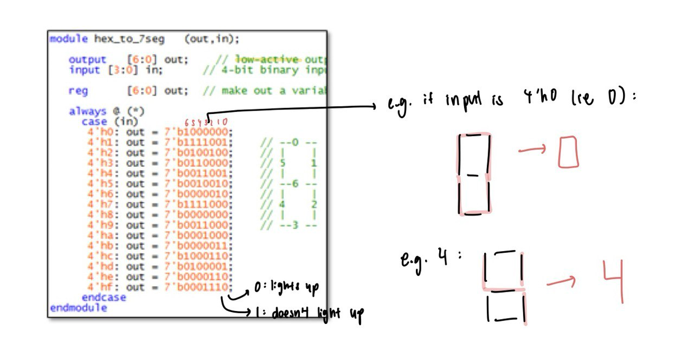
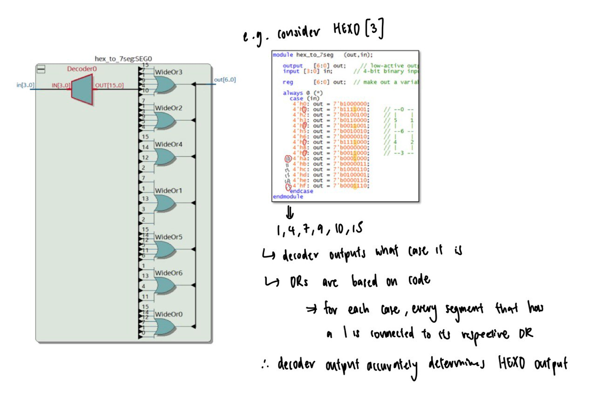
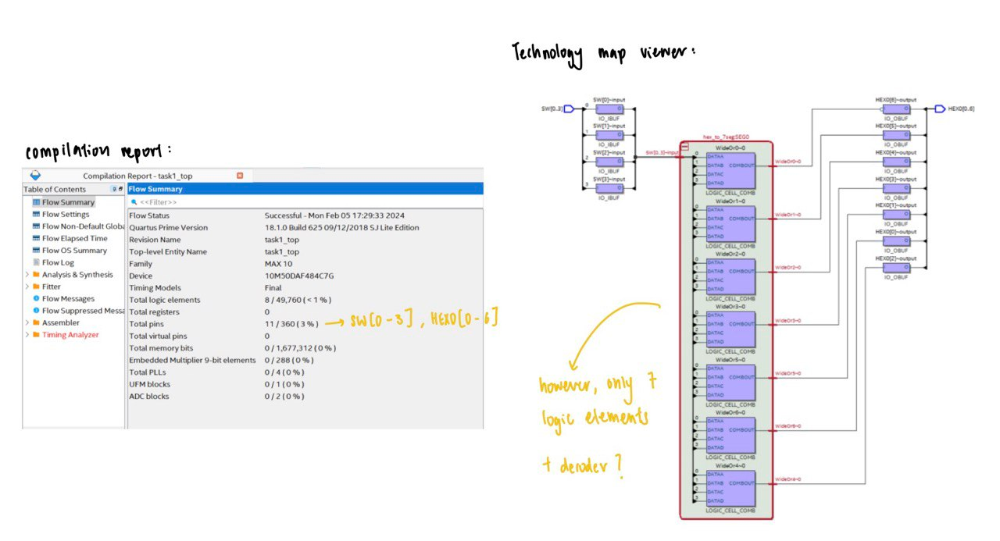
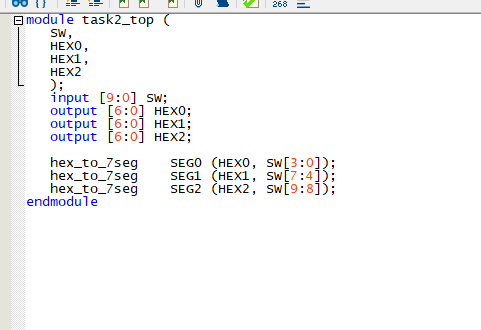
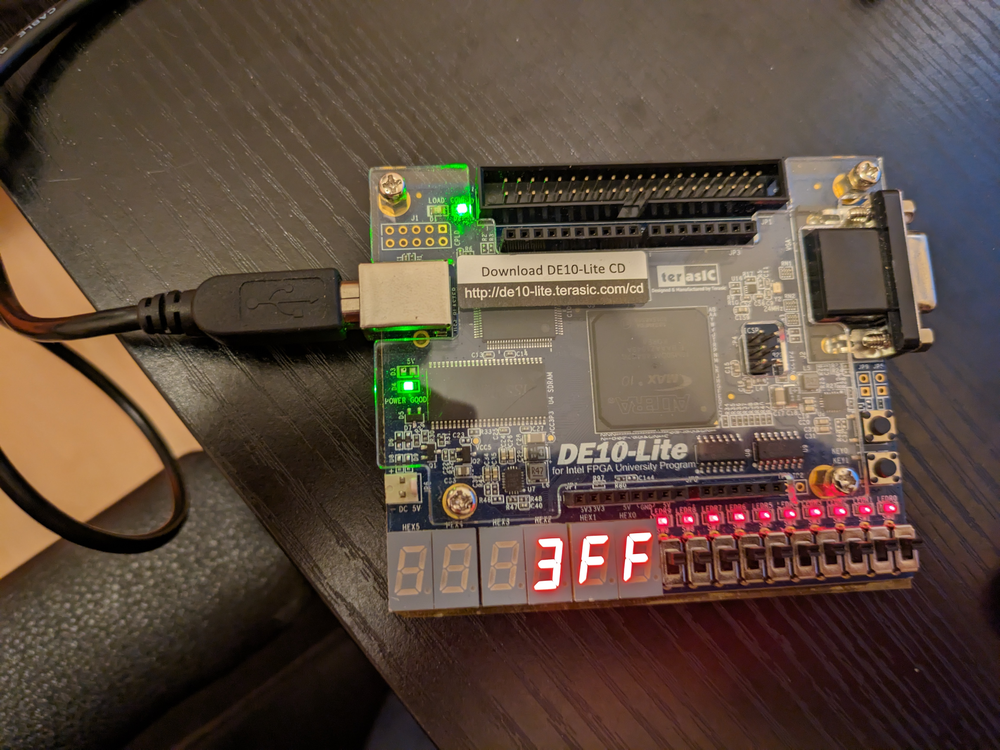

# Lab 1 logbook

## Table of Contents
1. [Task 1: The Design Flow – 7 Segment LED Display](#1-task-1)
2. [Task 2: Explore Netlist Viewer and Timing Analyzer](#2-task-2)
3. [Task 3: Test Yourself](#2-task-2)

# Task 1: The Design Flow – 7 Segment LED Display
Step 1: Create the project `task1`

Step 2: <u>Assign device</u>
- Click ==`Assignments -> Device`==
- Select **10M50DAF484C7G**
	- 10M: max10 family
	- 50: size of device (50,000 logic elements)
	- 484: number of pins
	- C7: speed grade

Step 3: <u>Creating the Verilog specification</u>
- Create desired design files - in this case, `hex_to_7seg.v`
- **Check** syntax of code by: ==`Process -> Analyze current file`==
- Add module into design by: ==`Project -> Add current file`==

Analysis of code:

Note: This is low-active, so 0 means that it lights up, 1 means it doesn't.

Step 4: <u>Create Top-Level Specification in Verilog</u>
- Create `task1_top.v`
- Specify that it is the top-level design by: ==`Project -> Set at Top-level Entity`==
- Verify that everything is working correctly by: `Process -> Start -> Start analysis and elaboration`

task1_top file

Step 5: <u>Pin assignment</u>
- Hard way: `Assignment -> Pin Planner` , and assign pins one by one
- Easy way: ==Insert `pin_assignment.txt` into the `.qsf` file==

Step 6: <u>Compiler the design</u>
- Click `Process -> Start Compilation` OR ==press the play button==
	- performs compilation, placement, routing, fitting etc
	- produces a **bit-stream** file (.sof)
		- a file that contains the configuration information for an FPGA
		- binary format
		- in this case, .sof (rather than .bin) because its specifically for all SRAM-based Intel devices supported by Quartus 
		- stands for SRAM (static random access memory) object file

Step 7: ==<u>Program the FPGA</u>
- Open ==`Tools > Programmer`==
- Ensure hardware is set up and connected to USB-Blaster
- Add file: `task1_top.sof`
- Click start

# Task 2: Explore Netlist Viewer and Timing Analyzer
Shows connection diagram for various inputs and outputs of task1_top.

Step 1: <u>RTL Viewer</u>
- Click `Tools > Netlist Views > RTL Viewer`
- Push down into this block and investigate what is being displayed and how it relates to the decode logic. 
- RTL Viewer only shows the abstract Boolean description of the design, not the physical implementation on the FPGA.

<u>Step 2: Technology Map Viewer</u>
- Click Tools > Netlist Views > Technology Map Viewer (post mapping). 

11 total pins, same as compilation report
- 7 wide-or logic gates + 1 decoder used in the hex_to_7 block
* note: [Primitives are low-level nodes that cannot be expanded to any lower hierarchy. ][https://class.ece.uw.edu/469/peckol/doc/rtlViewer.pdf]

The lower the temperature the lower the properagation delay

# Task 3: Test Yourself
I modified the top file to include all 10 switches as an input and created 3 instances of hex_to_7seg to display this.

Works correctly

