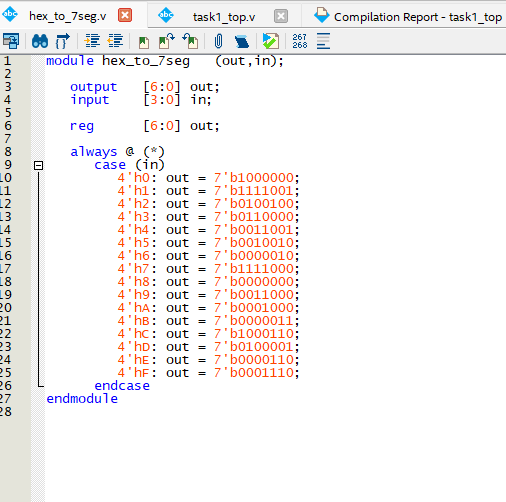
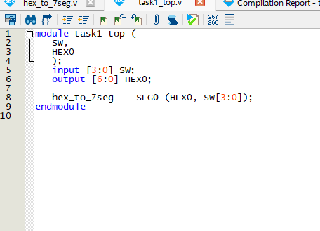
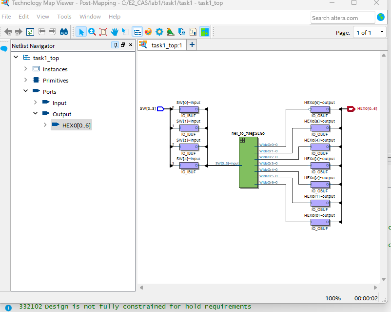
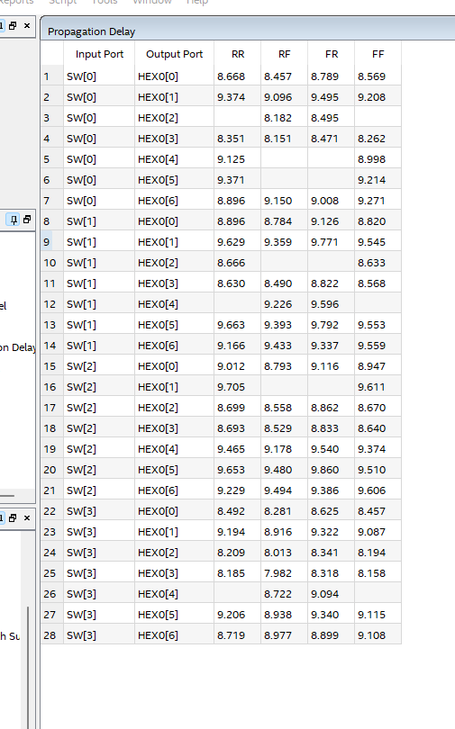
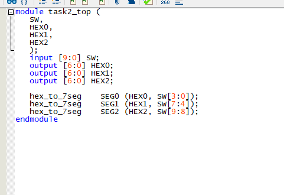
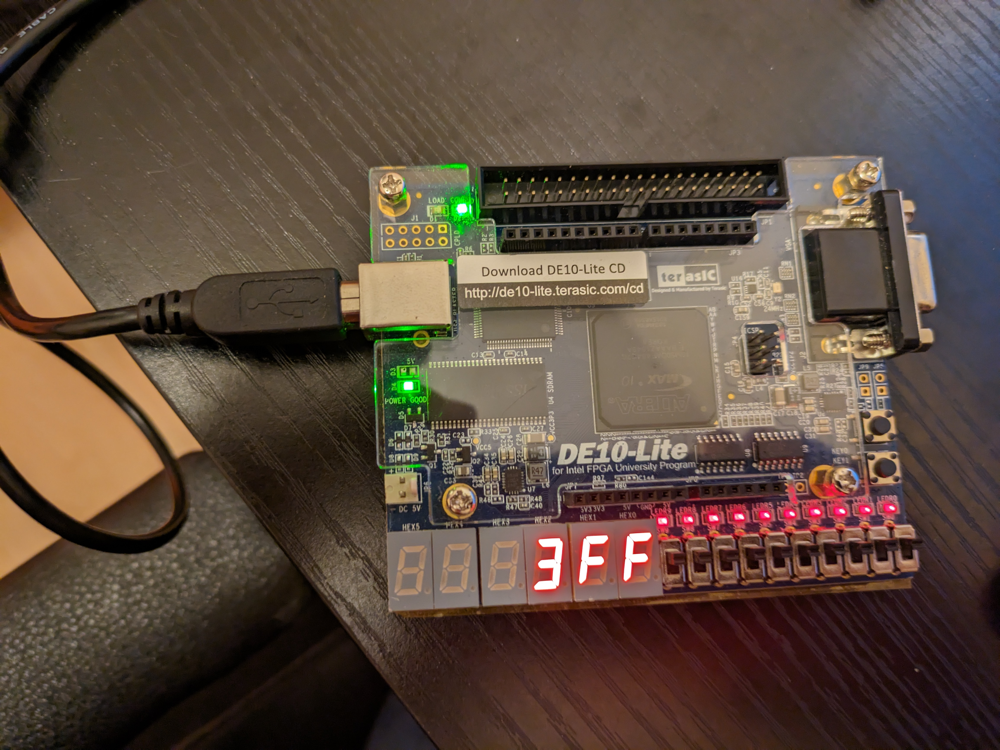

# Lab 1 logbook

## Table of Contents
1. [Task 1: The Design Flow – 7 Segment LED Display](#1-task-1)
2. [Task 2: Explore Netlist Viewer and Timing Analyzer](#2-task-2)
3. [Task 3: Test Yourself](#2-task-2)

# Task 1: The Design Flow – 7 Segment LED Display

hex_to_7seg file

task1_top file

# Task 2: Explore Netlist Viewer and Timing Analyzer
Shows connection diagram for various inputs and outputs of task1_top.

The lower the temperature the lower the properagation delay

# Task 3: Test Yourself
I modified the top file to include all 10 switches as an input and created 3 instances of hex_to_7seg to display this.

Works correctly

