# Lab 3 Notes:  Integrate an accelerometer with a NIOS

**Objectives**:
- Designed a NIOS II system that interfaces with the accelerometer on DE10- lite board
- Understand the design process of a NIOSII system and the SPI interface
- Learn how to read the acceleration value provided by the accelerometer
- Design a low-pass FIR filter to process the readings
- Investigate the impact of using low arithmetic precision to the quality of the results and the performance of your system.

## Task 1: Interface an accelerometer to a NIOS II system

- The DE10-lite comes with a digital accelerometer sensor module (ADXL345), commonly known as G-sensor. 
- This G-sensor = 3-axis accelerometer with high-resolution measurement.
- Digitalized output is formatted as 16-bit in two’s complement and can be accessed through SPI (3- and 4-wire) and I2C digital interfaces.
- SPI = Serial Peripheral Interface and it is one of the most common interfaces between a microprocessor and a peripheral, this is what we will use to interface the accelerometer to NIOS.

Create the QSYS file:

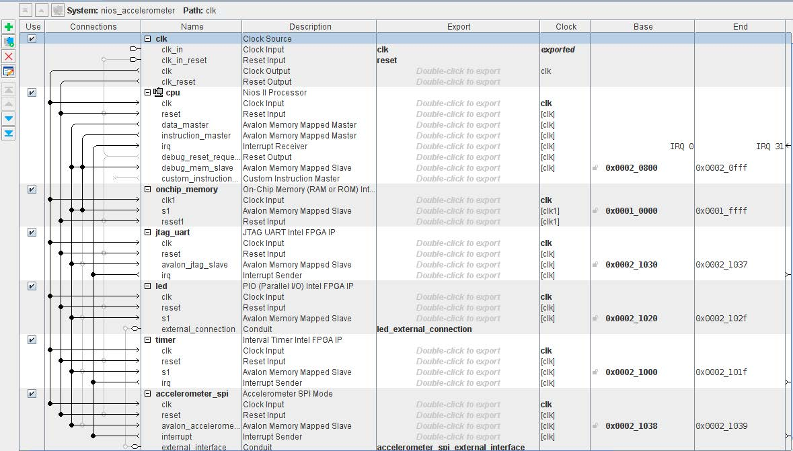

> Note: jtag_uart = Joint Test Action Group  Universal Asynchronous Receiver-Transmitter

Generate HDL, copy the instance v file into project and replace the C++ file with given code.

<u> Results: </u>

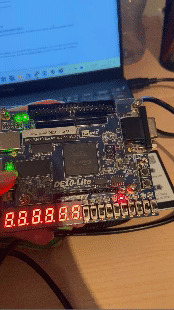

--> The LEDs should indicate the titling position of your board like a bubble floating in a spirit level.

## Task 2: Understanding of the code

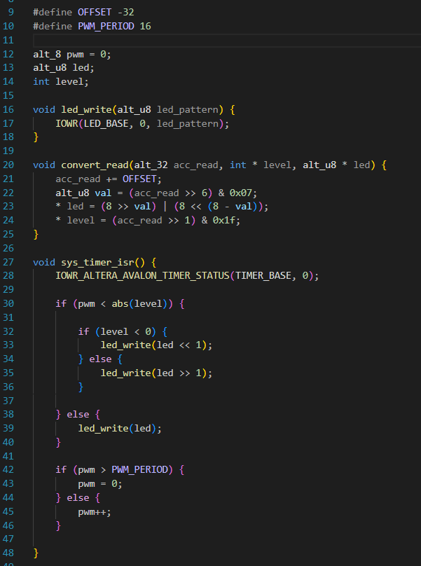
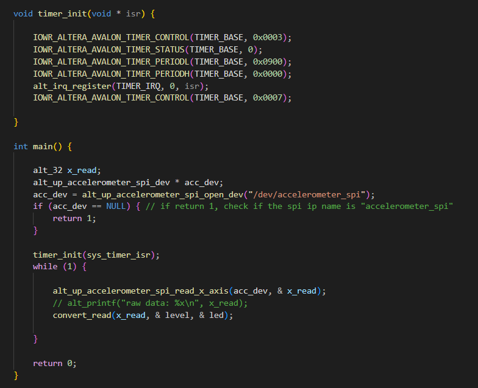

- Starting from the main(),  after some initialization, the code gets into a while loop, where the code retrieves the value for the x_axis from the accelerometer, and calls theconvert_read() function to map the x-axis reading to LED pattern.

- The convert_read() function converts the x_value to led and level pair in order to be used to drive the lighting up of the LEDs.

- Lighting up the LEDs:
The writing of the value on the LEDs is performed at a specific rate dictated by the timer. 
The sys_timer_isr() is an interrupt service routine that is executed when a specific interrupt is received.
As such, the processor will only execute this code at a specific intervals, letting the processor to focus on the execution of the while-loop code.

- Using the alt_print() function, you can print on the host terminal the actual values of the x_read.

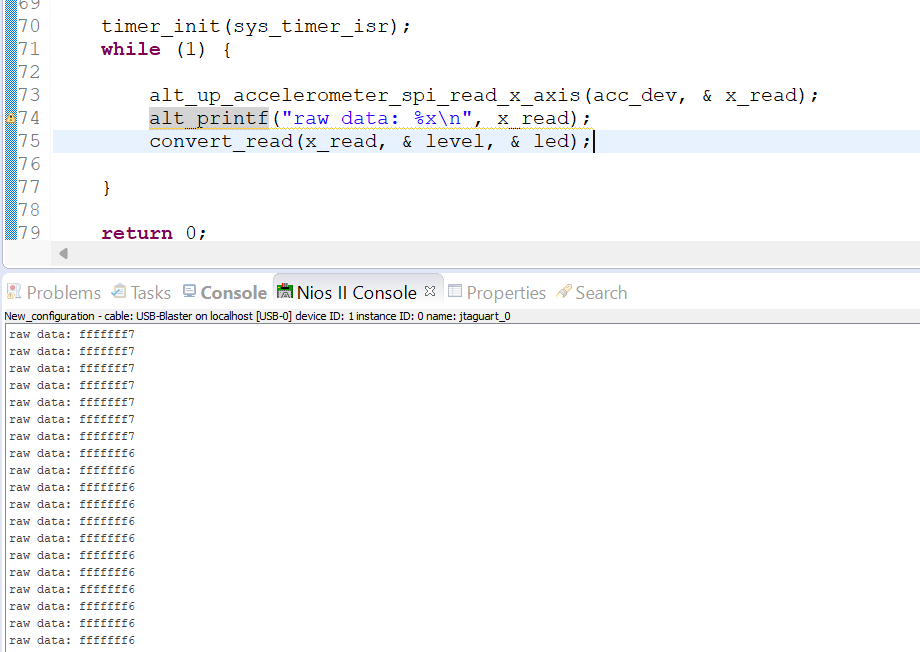

## Task 3: Implement an FIR filter to process the data

- add a function to perform a low-pass filtering of the accelerometer values
- will use an FIR filter 
> Finite Impulse Response =  filter whose output is determined entirely by a finite number of input samples and a set of filter coefficients. 
- can currently see that values are not the same when FPGA stable so need to filter out values

Explanation:
Implemented a simple 5-tap filter with all coefficients to have the same value to produce a moving average filter.

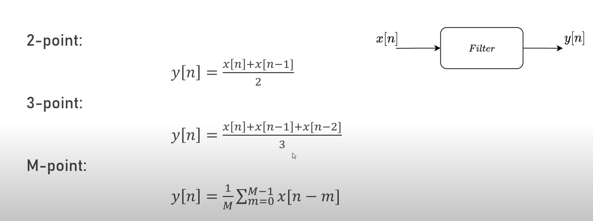
> each output value is the average of the current and some number of previous input values => smoothes out data and acts as a LP filter

<u>  Code </u>

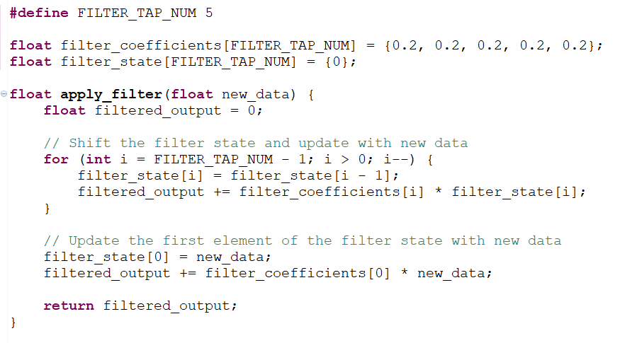

- **Initialization:** filtered_output is initialized to 0.

- **Shifting and Updating Filter State:** The loop iterates over the filter taps (from the last tap to the second tap). It shifts the filter state by one position to the right and updates filtered_output by multiplying each element of the filter state with its corresponding coefficient and summing them up.

- **Updating Filter State with New Data:** The first element of the filter state is updated with the new input data (new_data). filtered_output is updated by multiplying the new data with the first coefficient and adding it to the existing filtered_output.

The coefficients of the filter determine its frequency response:  coefficients at different frequencies determine how the filter attenuates or amplifies those frequencies.

Note: As number of taps increase, frequency selectivity increases and allows the filter to better isolate specific frequency bands. 

To visualise it, plotted through matlab and input a noisy sinewave:

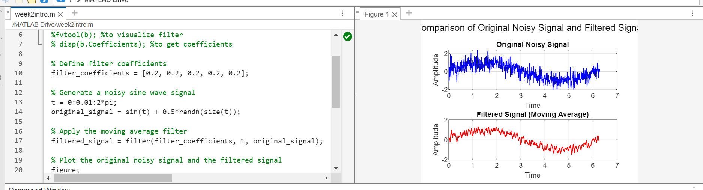

For more the double number of taps:
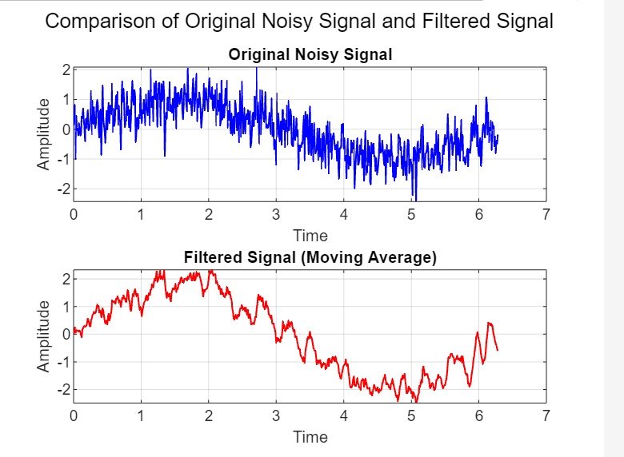

We can also design a LP filter though matlab to visualise it and then get the coefficients to plug in:

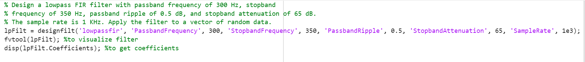
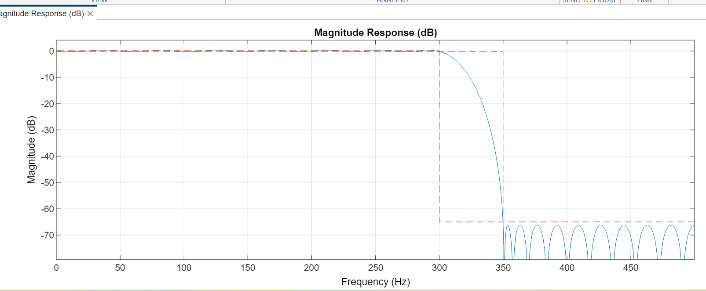

*Results:* 
When printing raw data it is less varying.
However physical results are less obvious to speed (ex: speed a bit faster but can't tell big difference)

Hence use the challenge to view results.

## Challenge: Optimize the FIR

As the number of taps increases, the time taken for the execution of the filtering function increases linearly. 
As  NIOS does not have native support for floating point operations, all floating-point multiplications and additions are emulated through fixed-point additions => sampling rate of the accelerometer decreases.

One way to increase the performance of the system is to consider converting the floating-point operations to fixed point ones.

New code:
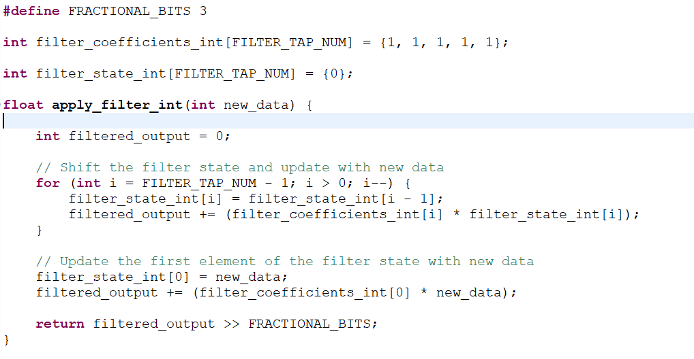

- Effect on execution time: INCREASE => Fixed-point arithmetic involves additional operations such as shifting and scaling, which can introduce overhead compared to floating-point arithmetic.
- Effect on Transfer function: Decrease in accuracy => fixed-point arithmetic introduces quantization errors due to limited precision, + effect on  deviations from the ideal frequency response

### Measuring the sampling frequency of the accelerometer

