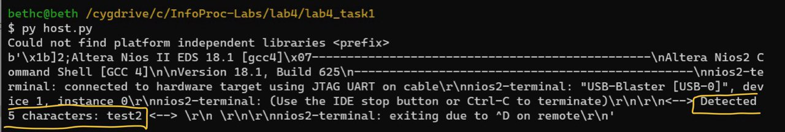

# Lab 4

## Understanding UART and JTAG:
**UART: Universal Asynchronous Receiver / Transmitter.** It defines a protocol, for exchanging serial data between two devices. UART uses two wires between transmitter and receiver to transmit and receive in both directions.

This is the UART frame format: 

As the UART protocol is asynchronous, the host needs to signal that data bits are coming. The **start bit** implements this signal.

After the data bits have been transmitted, the **stop bit** indicates the end of user data. A second (optional) stop bit can be configured, usually to give the receiver time to get ready for the next frame, but this is uncommon in practice.

The **data bits** are the user data or “useful” bits and are usually transmitted with the least significant bit first.

Example:
If we want to send the capital letter “B” in 7-bit ASCII, the bit sequence is 1 0 0 0 0 1 0. We reverse this sequence before sending them out: 0 1 0 0 0 0 1. After the last data bit is sent, the stop bit is used to end the frame and the line returns to the idle state.

**JTAG: Joint Test Action Group.** JTAG is used as a programming and debug port. 

The JTAG-UART component we add to our Platform Designer allows us to program and use the JTAG TAP of the FPGA.

From our understanding, the JTAG UART allows for UART connection with the FPGA board and the host without an additional wire: 

_Advantages over a regular UART:_ [source](https://tomverbeure.github.io/2021/05/02/Intel-JTAG-UART.html#the-intel-jtag-uart)

1. No extra cable between FPGA board and PC required.
2. Doesn’t require additional functional IO pins.
3. Multiple JTAG UARTs per FPGA possible, e.g. one per CPU core, all over the same JTAG connection.

The host side sends the UART data by creating a subprocess in the host. The new process runs the Nios II Command Shell batch file (NIOS_CMD_SHELL_BAT), which sets up a communication channel with the FPGA board. This allows Python to communicate with the Nios II terminal running on the FPGA board.

The board side polls the UART port for input using this function: alt_getchar().

See [this](https://www.youtube.com/watch?v=7xJ9dhVDCwU) diagram for the UART connection:

Take note that we use a different chip but diagram illustrates how the communication is established. 

## Task 1: UART communication with a host PC

A design is provided (`lab4_task1.zip`) that allows a NIOSII to communicate with the host PC through a UART interface. The main difference of this design is the addition of **off-chip memory**, **extending the memory capacity** of the system.

Design in zip file:

The system also includes a ==PLL (Phase-Locked Loop)==.

- The PLL can **generate a signal whose phase is related to an input signal**. 
- Signals to/from off-chip memory exhibit considerable delays
	- Therefore a shifted version of the clock (phase shift) that drives the off-chip memory related to NIOS needs to be used
	- Allows the data a full clock cycle for registration.
- Note: For establishing UART communication between the host PC and NIOS, you typically do not need to add off-chip memory, this is just for example purposes.

There are two sides to the communication, the host side (`host.py`) and board side (`jtag-uart-test/software/task1/task1.c`). 
### Explanation of given code
<u>1. Host side code</u>
- sends signals to the board
- waits for a response
- processes the response

- The host program sends signals to the board, waits on a response and then processes the response. 
- The board side code polls the UART port for input. Board-Side Code (`jtag-uart-test/software/task1/task1.c`):
	- In this case, the host is simply printing the response from the board.
	- To see more interaction capabilities of the board, look at the DE_seven_segment_display.c file.

In this design, the NIOS processing is put into a slave mode, responding to commands sent out by the host.
- To enable this to work, the `hello_world_time_limited.sof` can be directly used to program the DE10-Lite board and will directly work for the code described below.

The board-side code performs the following steps:
1. Reads characters brought in
2. The running variable is used to keep the while loop running indefinitely until the QUITLETTER variable is sent along the JTAG/UART line.
4. Inside the while loop, `alt_getchar()` reads from the /dev/jtag_uart port by extracting a single character. This also stalls the processing until a new character is encountered.
5. After the first character is received the text buffer gets filled with the input a. The new character is checked if it is a quitting character and is added to the text buffer, incrementing the text index pointer.
6. After all operations with the character are done, the next character is read in, until a new line ‘\n’ character is encountered.
7. After reading in the input, the text is printed back out to the host terminal
    - A string is generated, being ended with the character 0x4. This character returns Ctrl+D up to the host to get the host terminal to terminate. This is important to ensure your host code can keep running.
    - The string is then printed to the host terminal.
    - The text buffer is finally emptied out so that it can be used for the next input. Most of the code for the rest of the course will be added inside the while loop between generate_text and `print_text` function as this is best place to react to the produced string and provide a response that will be passed back to the host.

Below is the task1.c code with each step highlighted out:

After building the code in Quartus and Eclipse, enter the command
`nios2-terminal.exe <<< hello` in the NIOS II terminal to see if the communication is working.

Output was:

As expected, it detected the input hello, and counted 5 characters, exiting with Ctrl-D after the newline.

Next, I ran the host.py program.

As seen above, it correctly detected the input sent by the host program; in this case, "test2".

Most of the processing for the coursework will use variations of the perform_computation that will be used to send and receive data to and from the NIOS processor.

## Task 2: Extend your Lab 3 system

In this task, we integrate the provided infrastructure with our Lab 3 project (i.e. accelerometer), and modify the code so our system can operate between two modes depending on the command received by the host:

- Mode 0: no filtering of the accelerometer data
- Mode 1: filtering the accelerometer data should take place

### Hardware Design 

After some testing, we realised that the off chip memory was unnecessary for this task. Therefore, we could make use of the Platform Designer and DE10_Golden_Top files from Lab 3. 

### Software Design 
Since we used our Lab 3 design, we needed to build a Hello World Small project in Eclipse. 

The code is a combination of functions from: 
1. Filter from Lab 3 
2. Accelerometer from Lab 3 
3. UART connection from Lab 4 Task 1

Starting with the int main() part: 

We first ask the user to enter 0 or 1 for unfiltered or filtered data. 

We immediately read_chars(), which is this function: 

This function starts with alt_getchar(), which will extract the first character received from the UART port or waits until it gets one. We expect either a 0 or 1 input from our prompt. 

We introduced a new nextLetter variable and the loop so that we can detect a successful input from the terminal; the loop will keep reading characters until enter is pressed. 

Then, we change the value of mode depending on the input received. 

The function ends here and we go back to the main() code. If mode is 1 (user wants filtered data), we will apply filter and output the filtered data. 

Otherwise, we will just read x_value and output this unfiltered data. 

Videos of the board and the console output are as follows: 

1. Unfiltered (Mode 0)

2. Filtered (Mode 1)

